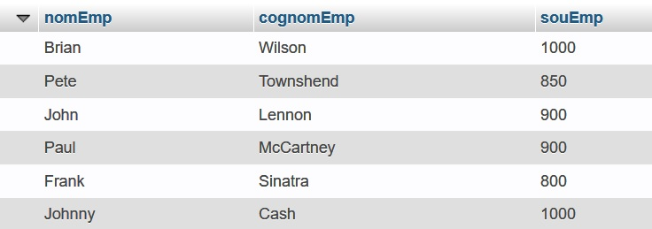
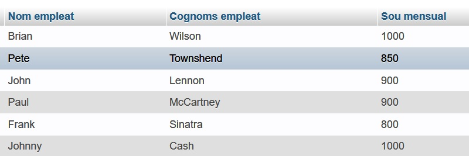
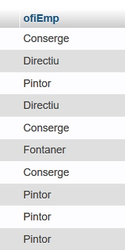
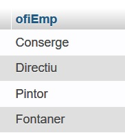

# Operadors BETWEEN, IS NULL i IN


# Operador BETWEEN

Podem utilitzar l'operador BETWEEN per comprovar que un valor estiga dins d'un interval. Funciona amb números i amb cadenes.

# Operador BETWEEN

<h3>Exemple</h3>

Si volem mostrar els empleats que cobren entre 500 i 1000 euros, ho podem fer posant dues condicions unides per un AND.
```sql
SELECT * FROM empleats WHERE empSou >=500 AND empSou <=1000;
```
L'alternativa és utilitzar l'operador **BETWEEN** per indicar en la condició que volem els valors que estiguen entre dues quantitats:
```sql
SELECT * FROM empleats WHERE empSou BETWEEN 500 AND 1000;
```

# Operador BETWEEN

<h3>Exemple</h3>

Si, pel contrari, volem llistar els empleats que no cobren entre 500 i 1000 euros, la manera més senzilla de fer-ho és afegir a la condició anterior l'operador NOT, que nega la condició.
```sql
SELECT * FROM empleats WHERE empSou NOT BETWEEN 500 AND 1000;
```

# Operador IN

Suposem que volem llistar els empleats que cobren 500, 600, 700, 800 o 900 euros. Ho podem fer posant totes eixes condicions unides per un OR (no s'han de complir totes, en una és suficient):

```sql
SELECT * FROM empleats WHERE empSou=500 OR empSou=600 OR empSou=700 OR empSou=800 OR empSou=900;
```

# Operador IN

Ara bé, també tenim un operador que ens facilita eixes consultes: **IN**. Amb eixe operador podem preguntar si un valor està en una llista. La mateixa consulta anterior, amb **IN**, seria així:
```sql
SELECT * FROM empleats WHERE empSou IN (500,600,700,800,900);
```
Per suposat, també podem negar la condició i mostrar els empleats que no cobren cap d'eixes quantitats:
```sql
SELECT * FROM empleats WHERE empSou NOT IN (500,600,700,800,900);
```
# Columnes calculades


# Columnes calculades

Entre el **SELECT** i el **FROM** hem de posar els noms de les columnes que voleu veure, però també podem posar altres coses com càlculs o expresions.

# Columnes calculades

<h3>Exemple</h3>
Un llistat dels empleats que cobren més de 1000€ al mes seria:

```sql
SELECT nomEmp,cognomEmp,souEmp FROM empleats WHERE souEmp > 1000;
```
Si volem que aparega en el llistat el que cobren a l'any, sempre que se puga calcular no hi ha cap problema. Si sabem que els  empleats cobren 14 pagues a l'any, podem fer un càlcul molt senzill:
```sql
SELECT nomEmp,cognomEmp,souEmp,souEmp*14 FROM empleats WHERE souEmp > 1000;
```
Així ens mostrarà en la columna `souEmp` el que cobren al mes, i en la columna `souEmp*14` el que cobren a l'any.

# Ordenar el resultat de la consulta


# Ordenar el resultat de la consulta

Per defecte la sentència **SELECT** mostra les files en el mateix ordre que estan guardades en la taula. Si volem veure el llistat ordenat d'una altra manera, ho podem fer afegint la clàusula **ORDER BY**. Podem especificar per quina columna o columnes volem que ordene el llistat, i també si volem que l'ordre siga ascendent (per defecte) o descendent.

# Ordenar el resultat de la consulta

<h3>Exemple</h3>

```sql
SELECT * FROM empleats;
```
mostra tots els empleats en l'ordre que estan a la taula.
```sql
SELECT * FROM empleats ORDER BY cognomEmp;
```
mostra tots els empleats ordenats alfabèticament per cognoms (de l'A a la Z)
```sql
SELECT * FROM empleats ORDER BY cognomEmp DESC;
```
mostra tots els empleats ordenats alfabèticament per cognoms però en ordre descendent (de la Z a l'A)

# Títols de les columnes


# Títols de les columnes

Si tenim noms de columnes com ara `nomEmp`, `cognomEmp`, `souEmp`, etc., i sobretot si tenim columnes calculades, quan fem el llistat potser voldrem canviar els títols.

Ho podem fer amb la clàusula **AS** en el **SELECT**.

# Títols de les columnes

Si fem

```sql
SELECT nomEmp, cognomEmp, souEmp FROM empleat;
```
obtindrem:



Si volem que els noms de les columnes canvien i tinguen més significat, ho podem fer amb la clàusula **AS** posant-li un alias a les columnes que ens interessen. 

# Títols de les columnes

<h3>Exemple</h3>

```sql
SELECT nomEmp AS `Nom empleat`, cognomEmp AS `Cognoms empleat`, souEmp AS `Sou mensual` FROM empleat;
```
donaria com a eixida:


# Mostrar valors únics


# Mostrar valors únics

De vegades ens interessa mostrar els valors que hi ha en una columna sense que apareguen valors repetits. Suposem que ens demanen una consulta que mostre quins oficis tenen els nostres empleats. El primer que faríem, segurament, és:
```sql
SELECT ofiEmp FROM empleat;
```
El resultat seria algo així:


# Mostrar valors únics

Com veiem, ens mostra els oficis repetits perquè torna tots els oficis de tots els empleats. Com fer que cada ofici aparega només una vegada? Utilitzant la clàusula **DISTINCT** en la consulta, que fa que no apareguen valors repetits.
```sql
SELECT DISTINCT ofiEmp FROM empleat;
```
Ara el resultat serà:



!!!note "Exercici 1"  

Si en la base de dades **cines** tenim una taula **cine** amb l'estructura:

- codigo (un id del cine)
- nombre (el nom del cine)
- ciudad (el nom de la població on està el cine)
  
Com podríem fer una consulta que ens mostre la llista de poblacions on hi ha cine? I si una ciutat té més d'un cine, com podem fer que només aparega una vegada en el llistat?
